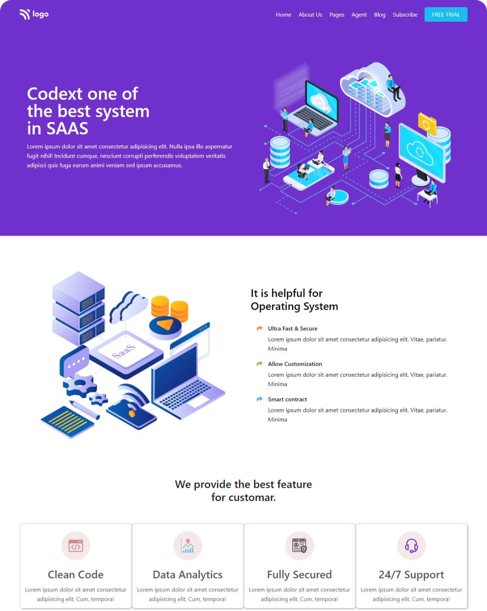

# Hi, This is Torjuman Rimon.

This is a Responsive landing page which is most like "Business Landing Page". It is one of the live class project from iNeuron's Full Stack JavaScript Bootcamp given by **[Hitesh Sir](https://github.com/hiteshchoudhary)**

 
 

- **Tailwind like CSS system**

  - I have to complete 5 HTML & CSS projects with responsive design. So, I decide to make a CSS system for all of my next project and which could speed up my development phase. And I am inspired from **TailwindCSS** to make these website responsibe.
  - It takes 3 day to figure out all css utility class for my project.

 

- **What I have learnd in this project**
  - Full web page with Header, Hero Section and Footer
  - rounded edge of Header
  - Media Queries
  - And - Icons placement
  - Mobile view
  - Flexbox
  - Wrap with flex
  - Hide elements at certain break point
  - Card design
  - Proper use of class based css style

 

- **Time needed to finish this project**

  - 5 : 00 hours

 

- **[Live Link](https://tr-saas-landing-page.netlify.app/)**

## Image from this project

 

### Desktop view

 

# Tech used

 

